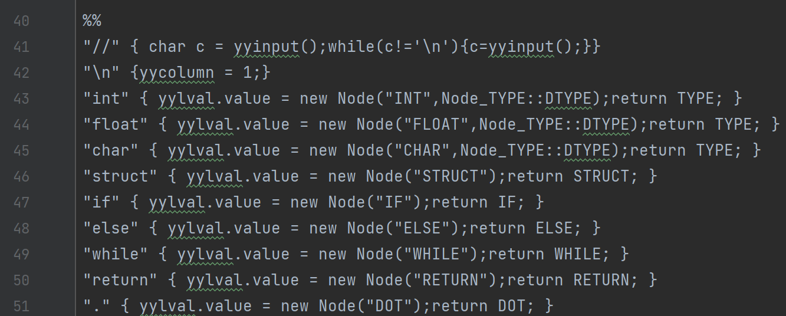
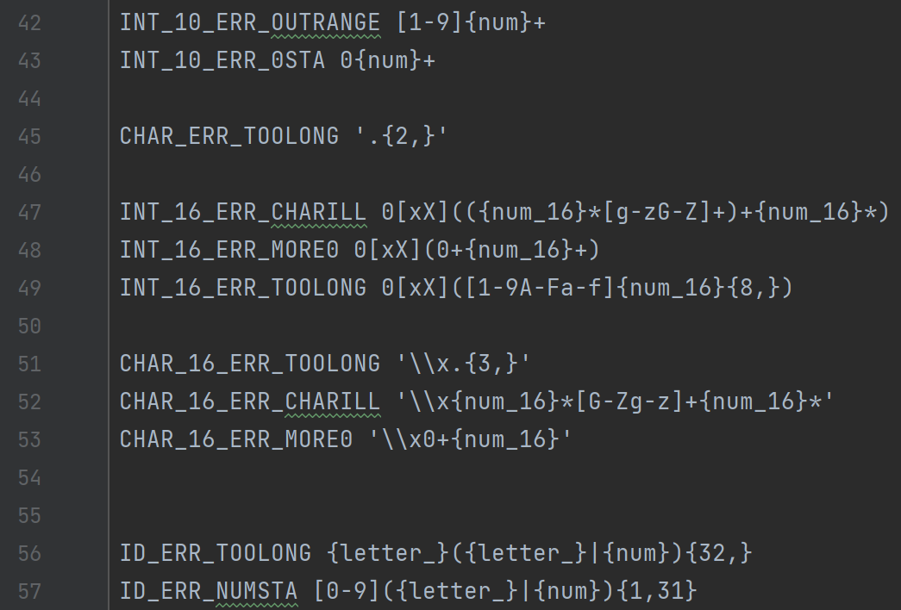
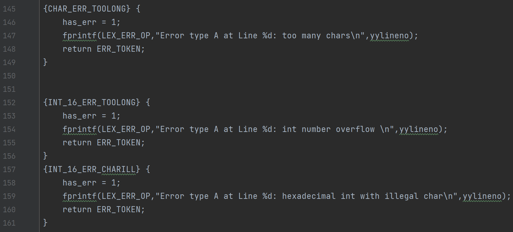
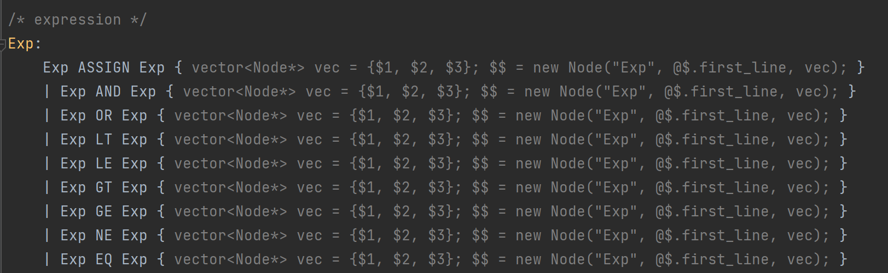

# CS323 Project1

###  Lexical Analysis & Syntax Analysis

##### **Team Members: Li Yuanzhao(11812420), Xu Xinyu(11811536), Jiang Yuchen(11812419)**


## I. Overview

​		In this project, we are required to implement lexical analysis and syntax analysis with lexer, syntaxer and other useful files in order to output a parser tree or possible lexical and syntax error information for given SPL(Sustech Programming Language) code. Our files can be run successfully with GCC version 7.4.0, GNU Flex version 2.6.4 and GNU Bison version 3.0.4 .


## II. Design and Implementation

### 	A. Lexer

​			In lexer part, we define a new class named `spl_node` which record the information of matched token for syntax analysis and final output.

```C++
enum class Node_TYPE{
    INT,
    FLOAT,
    CHAR,
    NAME,   //IF ELSE ASSIGN etc
    ID,     //ALL IDENTIFIERS
    DTYPE,  //DATATYPE, INCLUDING INT,FLOAT & CHAR
    LINE
};

class Node{
private:
    string name;
    //string id_name;// == string_value
    Node_TYPE TYPE;
    union{
        int lineno;
        int int_value;
        float float_value;
        char char_value;
    };
    vector <Node*> child;


public:
    
    Node();

    void print(int depth);

    Node(int val);
    Node(float val);
    Node(char val);
    
    Node(string name);
    Node(string name,Node_TYPE type);
    Node(string name,int line_no);
    Node(string name,int line_no, vector<Node*>& child);

    void set_child(vector<Node*>&);

    void show(int depth);

};
```

​				We define the variable `has_err`  to record whether there exists possible lexical and syntax error for final output. We also support single line comment symbol `//` besides given matching rules. We declare the illegal and error situations in detail so that we can handle all possible errors. All lexical error will be reported here with line number.







​														Figure.1 Some matching rules we defined in `lex.l`

### 	B. Syntaxer

​			As mentioned in Appendix B, we construct our syntaxer which will accept tokens and make actions or report errors(type B). In this part we will take use of class `Node` not only for tokens' information but also for level differentiation. Finally the nodes will form up  a tree to record those tokens' information when the program has no lexical and syntax error.

​			In syntaxer, we construct `vector<Node*> vec` to record the child nodes of the current node. If necessary, we can traverse the tree from root and output the whole parser tree as required.

​				

​																Figure.2 Syntax Design

### 	C. Other useful files

​		`spl_node.cpp` and `spl_node.hpp` are used to define the class `Node` and declare the fields and functions about it.

​		`main.cpp` are main function to start parsing and output parse tree.


## III. Test Cases

​			For evaluation purpose, our test cases contain 1 correct code, 2 type A errors and 2 type B errors. Including missing right curly braces and illegal identifier.


## IV. Instructions

​			Change directory to `/src` root and using `make splc` to create `splc` in `/bin` root for spl codes' parsing. 

​			Back to main root and using `./bin/splc ./test/<file_name>` to create output parsing tree.

​			

